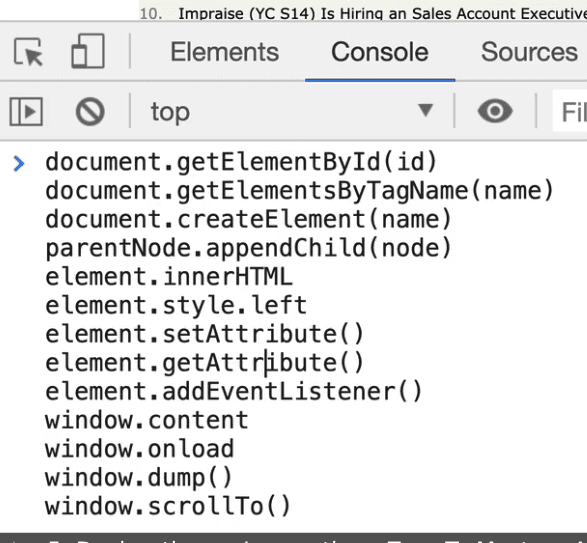
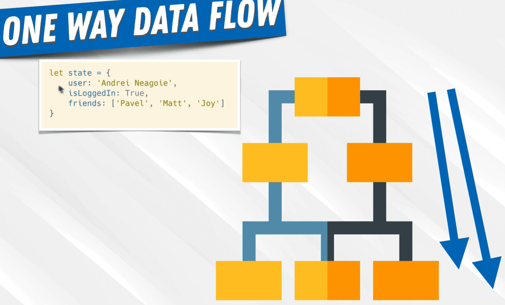

# zerotomastery-complete-react-developer

# Table of Contents

- [zerotomastery-complete-react-developer](#zerotomastery-complete-react-developer)
- [Table of Contents](#table-of-contents)
  - [0002\_Course\_Outline](#0002_course_outline)
  - [0003\_React\_Concepts](#0003_react_concepts)
  - [0004\_The\_Birth\_of\_React](#0004_the_birth_of_react)
  - [0005\_Declarative\_vs\_Imperative](#0005_declarative_vs_imperative)
  - [0006\_Component\_Architecture](#0006_component_architecture)
  - [0007\_One\_Way\_Data\_Flow](#0007_one_way_data_flow)
  - [0008\_UI\_Library](#0008_ui_library)

## 0002_Course_Outline

  

## 0003_React_Concepts

  

## 0004_The_Birth_of_React

  

## 0005_Declarative_vs_Imperative

  
  
  

## 0006_Component_Architecture

  
  

  
  

  

## 0007_One_Way_Data_Flow

  
  
  

## 0008_UI_Library

  
  

